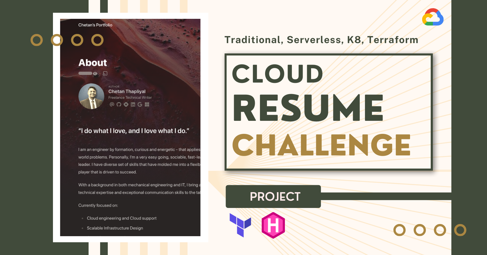
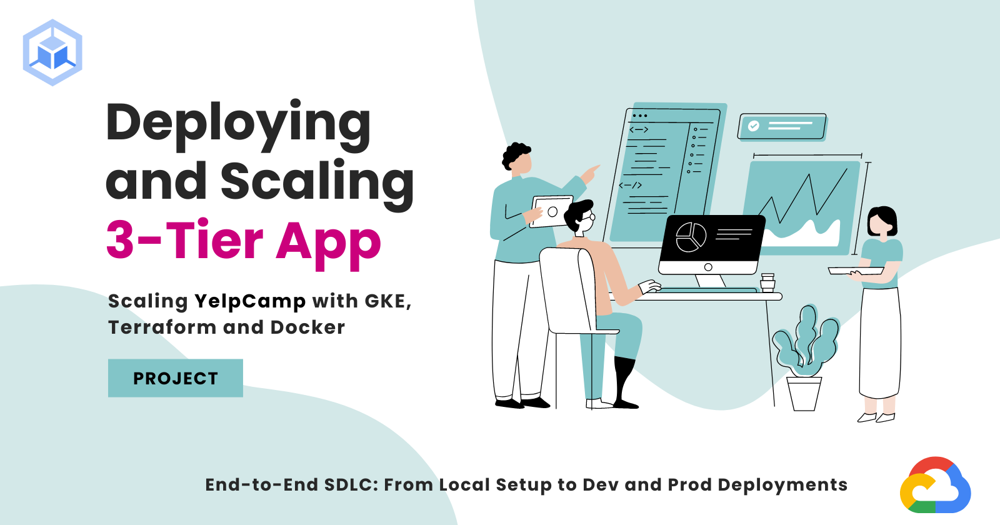
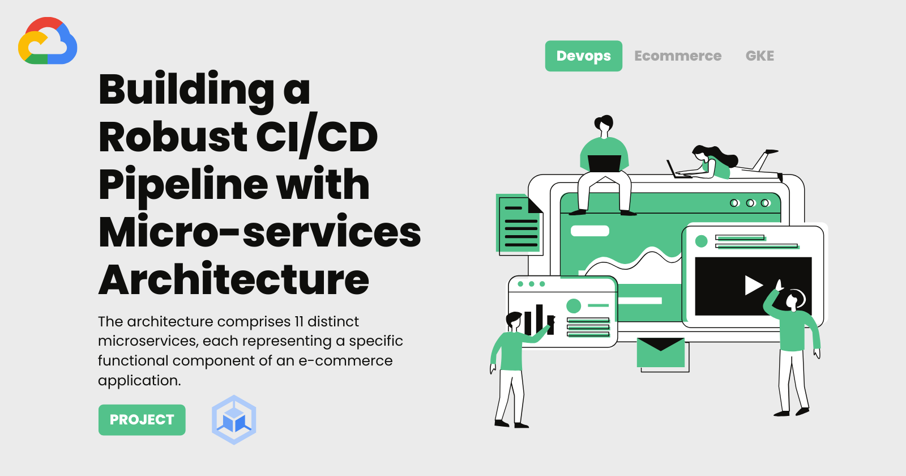
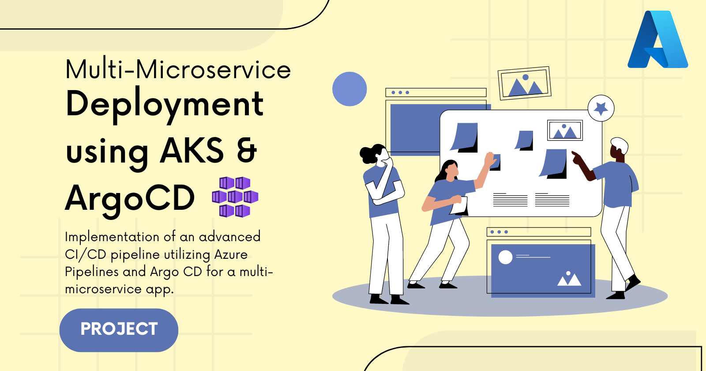
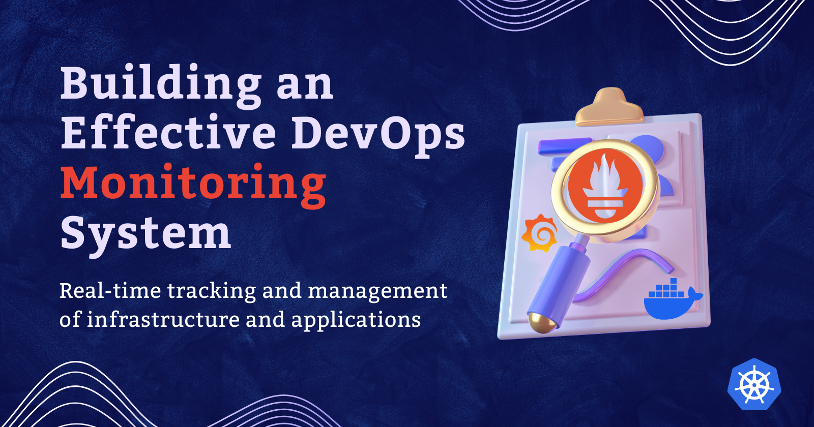
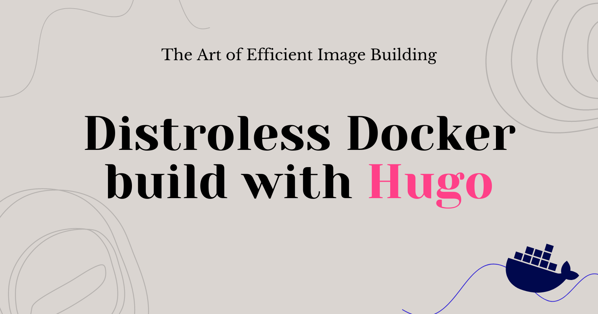
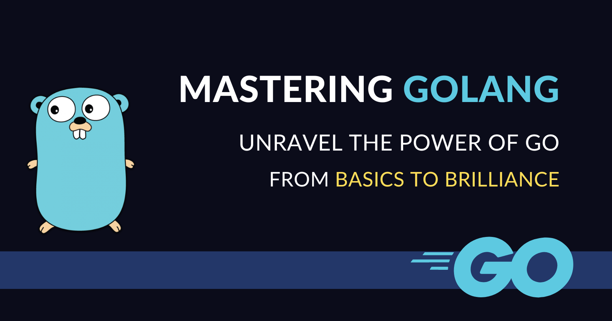


I'm continually carving out moments to delve into new projects and expand my knowledge horizons. While many of these passion projects may not materialize fully, they serve as invaluable opportunities for hands-on experimentation and growth in the real-world arena.


| Logo | Title | Description | Link |
|------|-------|-------------|------|
|  | Cloud Resume Challenge | The Cloud Resume Challenge is a hands-on project to build a personal resume website and host it entirely on GCP infrastructure.    | [Github](https://github.com/ChetanThapliyal/Cloud-resume-challenge-FE-GCP-Serverless) |
|  | Deploying and Scaling 3-Tier App | Deploying a YelpCamp application (a 3-tier full-stack website for campground reviews) across various environments using Cloud DevOps practices.    | [Github](https://github.com/ChetanThapliyal/yelpcamp-devops-gcp-docker-gke) |
|  | End-to-End Secure CI/CD Pipeline | A security-centric CI/CD pipeline built with Jenkins.    |  [Github](https://github.com/ChetanThapliyal/Secure-cloudNative-CI-CD-pipeline) |
|  | Microservices Architecture on GKE | A comprehensive CI/CD pipeline using a microservices architecture on GKE (11 distinct microservices). | [Github](https://github.com/ChetanThapliyal/microservices-ecommerce-cicd) |
|       | Argocd & AKS Microservices Deployment |  Implementation of an advanced CI/CD pipeline utilizing Azure Pipelines and Argo CD for a multi-microservice application. | [Github](https://github.com/ChetanThapliyal/Argocd-AKS-microservices-deployment) |
|       | Realtime DevOps Monitoring  | DevOps monitoring system designed for real-time tracking and management of infrastructure and applications. |  [Github](https://github.com/ChetanThapliyal/real-time-devops-monitoring)  |
|       | Hugo Multistage Docker build  | Optimize Docker images for a Hugo website (portfolio) using multi-stage builds. |  [Github](https://github.com/ChetanThapliyal/hugo-portfolio-multistage-docker)  |
|       | Get started with Go     | Github repo and blog series for learning the basics of GoLang. | [Github](https://github.com/ChetanThapliyal/get-started-with-Go) |

---

